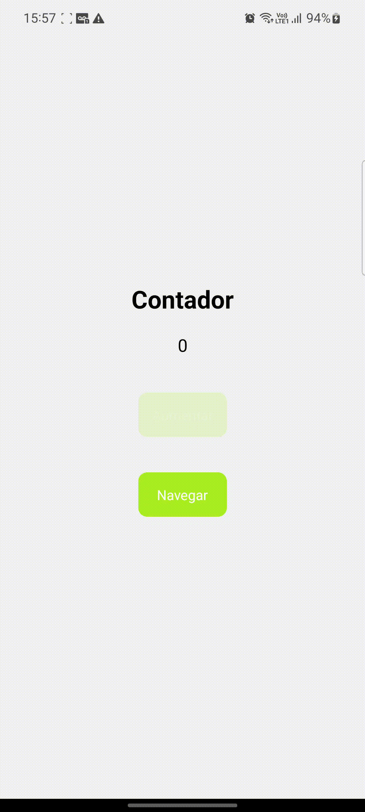

[![LinkedIn][linkedin-shield] ][linkedin-url]

<!-- PROJECT LOGO -->
 

  

<h3 align="center">Redux Example</h3>

  

    Uma simples aplicação dos meus estudos sobre Redux
     

<!-- ABOUT THE PROJECT -->

## Sobre

  

 
Uma simples aplicação utilizando o conceito de global state com Redux. Para isso, foi criado um contador que é capaz de ser atualizado em diferentes telas.

(<a href="#readme-top">back to top</a>)

### Tecnologias utilizadas

- <a href="https://reactnative.dev/"> React Native </a>
- <a href="https://expo.dev/"> Expo </a>
- <a href="https://redux.js.org/"> Redux </a>

(<a href="#readme-top">back to top</a>)

## Contato

Vinícius Latini Gonçavles - viniciuslatini2001@gmail.com

(<a href="#readme-top">back to top</a>)

[linkedin-shield]: https://img.shields.io/badge/-LinkedIn-black.svg?style=for-the-badge&logo=linkedin&colorB=555
[linkedin-url]: https://www.linkedin.com/in/viniciuslatini/
